# iGOT Deterministic Chatbot — Technical Design

> **Audience**: engineers, architects, technical reviewers.
> Timelines, ownership, and phasing live in a separate planning document.

---

## Table of Contents

1. [Problem Statement](#1-problem-statement)
2. [System Architecture](#2-system-architecture)
3. [Multi-Channel & Translation](#3-multi-channel--translation)
4. [Conversation Lifecycle](#4-conversation-lifecycle)
5. [Engine Internals](#5-engine-internals)
6. [The Four Flow Modes](#6-the-four-flow-modes)
7. [YAML Flow Schema](#7-yaml-flow-schema)
8. [LLM Dependency](#8-llm-dependency)
9. [Exemplar Use Cases](#9-exemplar-use-cases)
10. [Security & Data Handling](#10-security--data-handling)
11. [Tech Stack](#11-tech-stack)
12. [How to Add a New Flow](#12-how-to-add-a-new-flow)
13. [Key Design Decisions](#13-key-design-decisions)

---

## 1. Problem Statement

iGOT Karmayogi Bharat is India's national learning platform for civil servants, serving millions of officers across central and state governments. The L1 support team handles a large, repetitive volume of queries — certificate download failures, profile completion issues, course progress problems — following documented SOPs that branch on a small number of known conditions.

The previous attempt used an LLM as the conversation orchestrator. That approach:
- Hallucinated steps and made up API responses
- Was unpredictable and hard to audit for a government context
- Was expensive at scale, with no clear cost ceiling
- Could not be handed to the SOP team to modify without developer intervention

**iGOT Deterministic Chatbot's design premise**: for the vast majority of support queries, an LLM adds zero value on the happy path. A finite-state machine following a scripted SOP resolves the issue faster, more reliably, at zero LLM cost, and produces a fully auditable conversation trace. The LLM is reserved for a single, narrow task — paraphrasing a conversation into a human-readable Zoho ticket summary when the deterministic path could not resolve the issue. Even that call has an automatic template fallback so escalation never blocks on model availability.

### Goals

| Goal | Approach |
|------|----------|
| Predictable, auditable conversations | Deterministic FSM for all happy paths |
| Zero LLM cost on self-served queries | LLM called only at L2 escalation handover |
| Non-developer-readable flow definitions | YAML-declared flows; no flow logic in Python |
| Multi-channel from day one | Channel-agnostic Activity envelope |
| India data residency | Vertex AI Mumbai region; all infra on Karmayogi's existing EKS cluster |
| Graceful degradation | Every LLM call has a deterministic fallback |

---

## 2. System Architecture

### Context

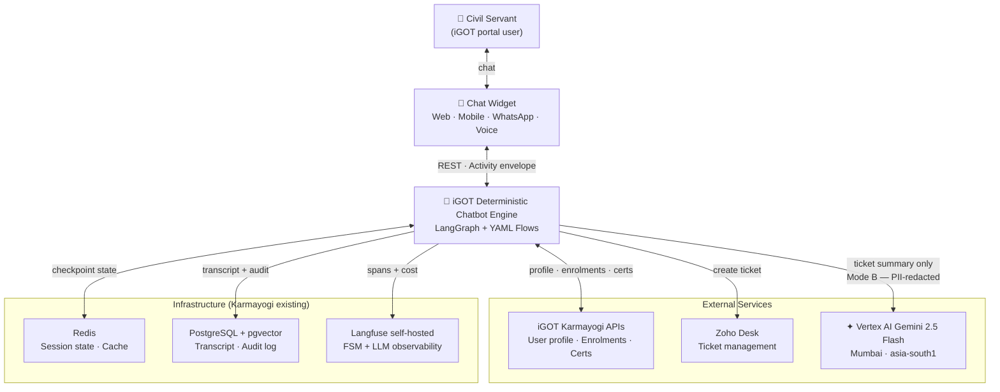

### Component breakdown

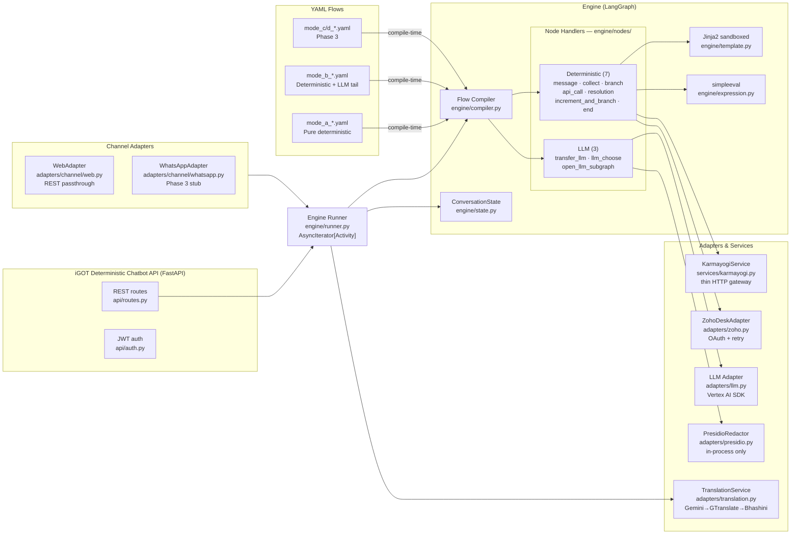

---

## 3. Multi-Channel & Translation

### Channel architecture

iGOT Deterministic Chatbot is designed channel-agnostic from day one. Phase 1 ships the web REST channel; WhatsApp and voice are stubbed and ready.

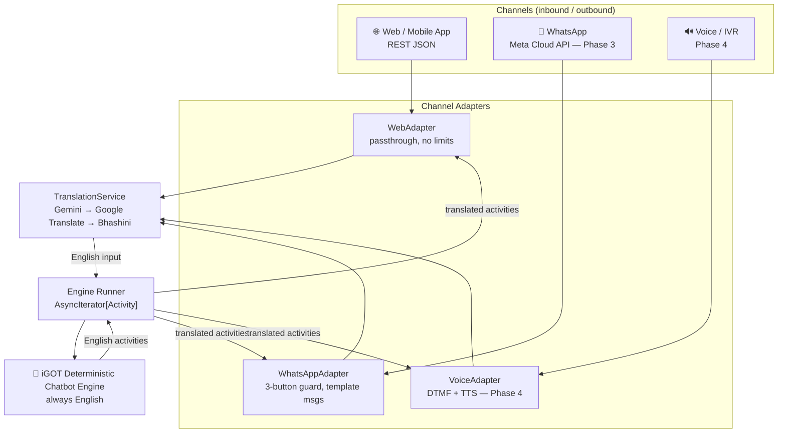

**Language-at-boundary rule**: The engine and all flow YAMLs operate in English only. Translation is applied by the runner — inbound text is translated to English before the engine sees it; outbound activities are translated back to the user's preferred language before the channel adapter formats them.

### Translation failover chain

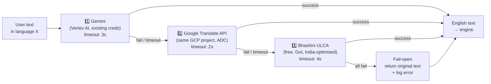

Same chain applies outbound (English → user language). Fail-open means a translation failure never crashes a conversation — the user sees the English text in the worst case.

### WhatsApp button guard

WhatsApp enforces a hard limit of 3 quick-reply buttons. `BaseChannelAdapter.guard_quick_replies()` auto-upgrades any `quick_replies` activity with more than `max_quick_reply_buttons` choices to a `picker` (list message). **Flow YAML authors never need to know this constraint** — they write `quick_replies` and the channel adapter adapts.

```
quick_replies (≤ 3)  ──→  Interactive Button Message  (WhatsApp)
quick_replies (> 3)  ──→  auto-upgraded → picker  ──→  Interactive List Message
picker               ──→  Interactive List Message
```

### REST → WebSocket upgrade path

The engine runner exposes an **`AsyncIterator[Activity]`** interface — not a list return. This means the channel transport can change without touching the engine or any YAML:

```python
# Phase 1 — REST (collect all activities)
activities = [a async for a in run_turn(state, action, translation_svc)]
return JSONResponse({"activities": activities})

# Phase 2 — WebSocket (stream as produced, no engine change)
async for activity in run_turn(state, action, translation_svc):
    await ws.send_json(activity.model_dump(exclude_none=True))
```

### Session expiry

Sessions use a **sliding TTL** reset on every user turn:

| Channel | Default TTL | Reset trigger |
|---------|-------------|---------------|
| Web / Mobile | 30 min | Every POST `/turn` |
| WhatsApp | 24 h | Every inbound message (Meta window) |
| Voice | Session-scoped | Call hangup |

On expiry, the runner emits a single `text` activity — _"Your session timed out. Let's start fresh."_ — and the engine does not execute. The client creates a new session. No mid-flow state is shown to a returning user (stale API data, expired tokens).

---

## 4. Conversation Lifecycle

### Session state machine

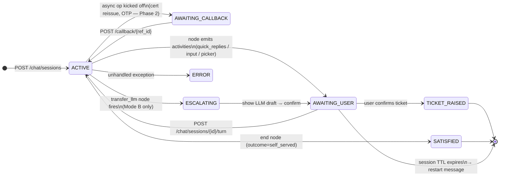

### Turn sequence (with translation)

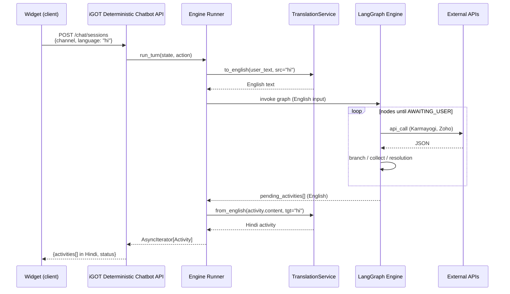

---

## 5. Engine Internals

### YAML → LangGraph compilation pipeline

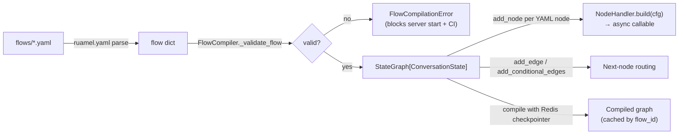

Server startup fails if any YAML fails compilation. CI runs `python -m app.engine.compiler --validate flows/` on every PR.

### ConversationState

Full session state; serialised to Redis after every node by LangGraph's Redis checkpointer.

```python
class ConversationState(BaseModel):
    # Identity
    session_id:      UUID
    user_id_hash:    str      # HMAC of Karmayogi userId — raw id never stored
    channel:         Channel  # web | mobile | whatsapp | voice
    language:        str      # BCP-47 preferred language ("en", "hi", "ta", …)

    # Session lifecycle
    created_at:      datetime
    expires_at:      datetime | None  # sliding TTL; refreshed on every user turn
    last_activity_at: datetime

    # Flow control
    flow_id:         str | None
    current_node:    str | None
    status:          FlowStatus
    # FlowStatus values:
    #   ACTIVE | AWAITING_USER | AWAITING_CALLBACK | ESCALATING |
    #   TICKET_RAISED | SATISFIED | ENDED | ERROR

    # Message log (LangGraph append-only reducer)
    messages:        list[Message]

    # Structured data captured by collect nodes
    collected:       dict[str, Any]

    # Counters for increment_and_branch (Mode B retry pattern)
    counters:        dict[str, int]

    # Output buffer — drained by API layer after each turn
    pending_activities: list[dict]

    # Ticket
    ticket_draft:    TicketDraft | None
    zoho_ticket_id:  str | None

    # Cost control
    llm_calls_this_session: int   # capped at 1 for Mode A/B
```

### Activity envelope

Bot output is structured payloads, not channel-specific markup. Each channel adapter renders them natively.

| Activity type | Description | Channel rendering |
|---|---|---|
| `text` | Plain string | paragraph |
| `markdown` | GitHub-flavoured markdown | rendered HTML / TTS stripped |
| `quick_replies` | Button list with `id`, `label`, optional `spoken_label`, `dtmf` | buttons / WhatsApp list / IVR keypad |
| `picker` | Searchable scrollable list with `meta` sub-label | search input + scroll / WhatsApp list |
| `input` | Free-text field with optional regex validation | text input |
| `typing` | Typing indicator | animated dots / voice silence |
| `end` | Terminal signal; carries `outcome` | close widget / call hangup |
| `trace` | Admin-only debug dump | dev tools only |

---

## 6. The Four Flow Modes

Every YAML flow declares a `flow_type`. The engine compiles and routes it accordingly.

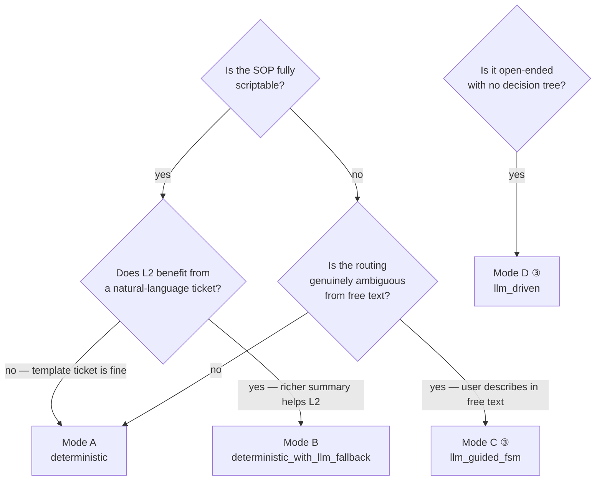
③ Phase 3 only

---

### Mode A — Pure Deterministic (`flow_type: deterministic`)

```
User input → branch → scripted steps → satisfaction check → [ticket via template | self-served]
```

- Zero LLM calls. Works on voice/IVR. Fully auditable.
- Ticket payload is a Jinja template rendered from `ctx.collected` fields.
- Use when: the SOP has a finite, known decision tree and scripted responses cover all branches.

---

### Mode B — Deterministic + LLM Tail (`flow_type: deterministic_with_llm_fallback`)

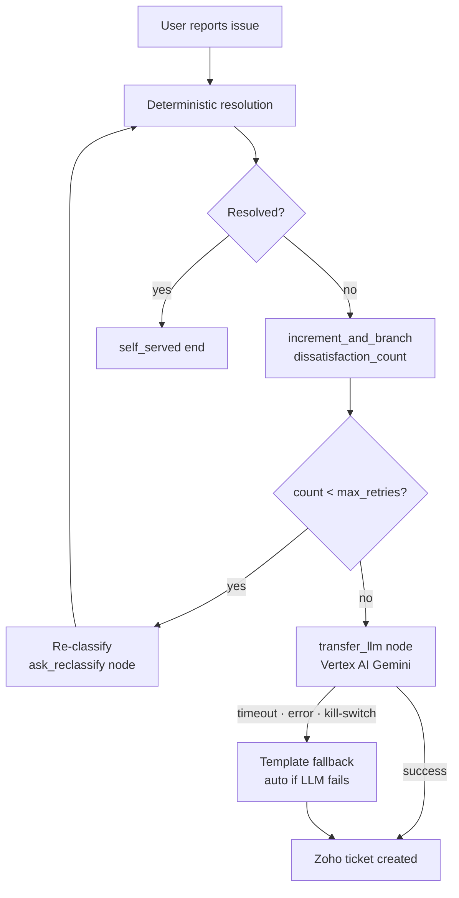

- The LLM sees a PII-redacted conversation transcript + `collected` dict.
- Its only job: write a 3–5 sentence ticket description and suggest a subject line.
- The LLM **never** decides conversation routing. `transfer_llm` is a terminal node — after it fires, the user confirms the draft and the ticket is created.
- Template fallback means escalation **never blocks** on model availability.

---

### Mode C — LLM-Guided FSM (`flow_type: llm_guided_fsm`) — Phase 3

```
User free-text → llm_choose node → one of N declared next-nodes → deterministic sub-flow
```

- LLM picks exactly one candidate from a YAML-declared list (`candidates:` with `criteria:`).
- Output is validated against the enum of node ids — the LLM cannot invent a branch.
- Confidence threshold: if LLM response < threshold → deterministic default branch.
- Use when: the opening question is genuinely ambiguous (user describes "course problem" in free text and the bot must classify it as progress / certificate / content).

---

### Mode D — Open LLM with Tools (`flow_type: llm_driven`) — Phase 3

```
User query → open_llm_subgraph (RAG + tool calls) → structured recommendations → deterministic render
```

- Full agentic LangGraph subgraph. LLM can invoke declared tool wrappers (Karmayogi API search, pgvector course search).
- RAG-bounded: only indexed course catalog is in context. Topical guardrails block off-topic queries.
- Output structured via Outlines/Instructor — free-form LLM text never reaches the user directly.
- Use when: the request is genuinely open-ended (course recommendation, KB Q&A). Rare.

---

### Mode comparison

| | Mode A | Mode B | Mode C | Mode D |
|---|---|---|---|---|
| LLM calls per session | 0 | 0–1 | 0–1 | 1–5 |
| LLM role | — | Ticket summariser | Intent classifier | Orchestrator + retriever |
| Flow logic location | YAML only | YAML only | YAML + LLM choice | LangGraph subgraph (Python) |
| Voice-safe | ✅ | ✅ | ⚠️ (ASR errors) | ❌ |
| Auditable | ✅ fully | ✅ FSM + LLM span | ✅ FSM + choice log | ⚠️ complex |
| Phase | 1 | 1 | 3 | 3 |

---

## 7. YAML Flow Schema

### Flow-level fields

```yaml
flow_id:   CERTIFICATE_DOWNLOAD        # SHOUTY_SNAKE — must be unique across all flows
flow_type: deterministic_with_llm_fallback  # deterministic | deterministic_with_llm_fallback
                                            # (Phase 3: llm_guided_fsm | llm_driven)
version:   1

metadata:
  # ── Chat menu (dynamic — no Python changes needed) ──────────────────────────
  menu_label:       "🎓 Certificate issue"  # button text; omit to hide from menu entirely
  menu_group:       "Learning"              # logical group label shown in future grouped UI
  menu_order:       1                       # sort position in picker (lower = higher)
  menu_hidden:      false                   # true → hides from menu but still callable via API
  enabled:          true                    # false → disabled entirely; router rejects it at API

  # ── Zoho ticket defaults (used by _zoho_ticket fragment) ───────────────────
  category:         course
  classification:   Query                   # Service Request | Query | Incident
  default_portal:   Learner Portal
  default_priority: P4
  default_severity: Sev 4

enabled_channels: [web]                    # web is the only active channel (Phase 1)
                                           # whatsapp / mobile / voice deferred to Phase 2-4

entry_node: ask_certificate_issue          # ID of the first node to execute

nodes:
  - id: ask_certificate_issue
    type: message
    ...
```

> **Note:** `classification.triggers` (phrase list for intent routing) and `llm_fallback_policy` were removed in Phase 1. Menu routing is driven by `metadata.menu_label` — the user picks from the generated topic picker. `choice_id` sent from the client equals the `flow_id` directly; no separate mapping table is needed.
>
> **Flow visibility vs. accessibility:**
> - `menu_hidden: true` — hides from the topic picker UI, but a client that knows the `flow_id` can still call it via the API. Intended for dev/QA-only flows.
> - `enabled: false` — the flow is compiled at startup (YAML errors still surface), but the router refuses to start it. Use for WIP flows or flows paused mid-sprint without deleting the YAML.

---

### Node type reference

| Node type | Phase | LLM? | Key fields |
|---|---|---|---|
| `message` | 1 | No | `prompt.text`, `quick_replies[]` (with `id`, `label`, `icon`), `disable_input`, `on_reply`, `next` |
| `collect` | 1 | No | `prompt` or `prompts[]`, `field.name`, `field.type` (text/select/email/date), `dynamic_options`, `next` |
| `branch` | 1 | No | `rules[]: {if: expr, then: node_id}`, `default` |
| `api_call` | 1 | No | `integration`, `request: {method, url, params, body, headers}`, `response_mapping[]`, `on_success`, `on_error`, `timeout_ms` |
| `resolution` | 1 | No | `prompt.text`, `steps[]`, `follow_up: {text, quick_replies[]}`, `on_reply: {choice_id: node_id}` |
| `increment_and_branch` | 1 | No | `counter`, `rules[]: {if: expr, then: node_id}`, `default` — increments named counter first, then evaluates rules; used for retry-before-LLM pattern |
| `end` | 1 | No | `outcome` (self_served / ticket_raised / ticket_failed), `prompt.text` |
| `transfer_llm` | 1 | **Yes** | `llm_context: {include_messages, include_collected, include_flow_meta}`, `llm_directives: {objective, priority_override}`, `on_complete`, `auto_raise` |
| `llm_choose` | 3 | **Yes** | `input`, `candidates[]: {id, criteria}`, `confidence_threshold`, `default` |
| `open_llm_subgraph` | 3 | **Yes** | `subgraph`, `inputs`, `timeout_seconds`, `max_llm_calls`, `store_as`, `on_success`, `on_error` |

**`transfer_llm` — `auto_raise` flag:**
- `auto_raise: false` (default): shows ticket draft to user, asks for confirmation before raising.
- `auto_raise: true`: generates ticket summary silently and proceeds directly to `on_complete` — no user confirmation step. Use when the flow has already exhausted deterministic paths and you want clean escalation without an extra confirmation round.

**`end` — outcomes and their UI banner:**

| outcome | Banner | Use when |
|---|---|---|
| `self_served` | ✅ Green | User confirmed the issue is resolved |
| `ticket_raised` | 🎫 Blue | Zoho ticket created successfully |
| `ticket_failed` | ⚠️ Orange | Zoho API call failed; show support email |

**`quick_replies` — web-only fields:**
- `id`: choice identifier stored in `collected._last_choice_id`
- `label`: button text
- `icon`: optional emoji shown on the button face
- `dtmf` and `spoken_label` are **not used** — voice is disabled in Phase 1; do not add them.

---

### `api_call` — request block convention

All API details live in YAML. Python adapters inject base URL + auth only.

```yaml
- id: fetch_user_profile
  type: api_call
  integration: karmayogi          # registered adapter name
  request:
    method: GET
    url: "/api/user/private/v1/read/{{ ctx.user_id_hash }}"
    params:
      fields: "firstName,profilePercent,profilePhoto"
  response_mapping:
    - { from: $.firstName,      to: collected.first_name }
    - { from: $.profilePercent, to: collected.completion_pct }
  on_success: diagnose_missing_fields
  on_error:
    timeout: escalate_timeout
    any:     escalate_generic
  timeout_ms: 5000
```

```yaml
# Zoho ticket creation is handled by the _zoho_ticket shared fragment (imported via `imports:`).
# Direct api_call to Zoho is shown here for reference only — use the fragment in real flows.
- id: raise_ticket
  type: api_call
  integration: zoho_desk_api
  request:
    method: POST
    url: "/tickets"
    body:
      subject:        "[ITSM Support v2] {{ ctx.ticket_draft.subject }}"
      description:    "{{ ctx.ticket_draft.description }}"
      email:          "{{ ctx.collected.email | default('') }}"
      priority:       "{{ ctx.ticket_draft.priority | default('P3') }}"
      departmentId:   "{{ env.ZOHO_DEPARTMENT_ID }}"
      contact:
        firstName: "{{ ctx.collected.first_name | default('iGOT') }}"
        lastName:  "{{ ctx.collected.last_name | default('User') }}"
        email:     "{{ ctx.collected.email | default('') }}"
      cf:
        cf_source:         "ITSM Support v2"
        cf_severity:       "{{ ctx.ticket_draft.severity | default('Sev 3') }}"
        cf_category:       "account"
        cf_sub_category:   "login_issue"
        cf_flow_id:        "LOGIN_ISSUE"
        cf_portal:         "Learner Portal"
        cf_channel_source: "{{ ctx.channel }}"
        cf_bot_session_id: "{{ ctx.session_id }}"
  response_mapping:
    - { from: $.ticketNumber, to: collected.ticket_id }
  on_success: ticket_confirmation
  on_error:
    any: ticket_creation_failed
  timeout_ms: 10000
```

**Template variables in `url`, `params`, `body`, `headers`:**

| Variable | Description |
|---|---|
| `ctx.collected.*` | All values captured by collect nodes, API response mappings, and on_reply.save_to |
| `ctx.counters.*` | Named counters from increment_and_branch |
| `ctx.user_id_hash` | HMAC hash of Karmayogi user ID (safe in URLs) |
| `ctx.session_id` | UUID of the current session |
| `ctx.flow_id` | Current flow ID (e.g. `"LOGIN_ISSUE"`) |
| `ctx.channel` | `"web"` / `"whatsapp"` / `"mobile"` / `"voice"` |
| `ctx.language` | BCP-47 preferred language (`"en"`, `"hi"`, …) |
| `ctx.ticket_draft.*` | LLM/template ticket fields (subject, description, priority, severity, category) |
| `env.ZOHO_DEPARTMENT_ID` | Server-side env var — never user-controlled |

Registered HTTP integrations: `karmayogi`, `zoho_desk_api`.  
**Presidio is not an HTTP integration** — it is called in-process by `transfer_llm` before building the LLM prompt.

---

### `collect` — dynamic options (API-driven picker)

```yaml
- id: pick_course
  type: collect
  prompt:
    text: "Which course's certificate is missing?"
  field:
    name: collected.course_id
    type: select
  dynamic_options:
    source: api
    integration: karmayogi
    request:
      method: POST
      url: "/api/course/private/v4/user/enrollment/list/{{ ctx.user_id_hash }}"
      body:
        request:
          filters:
            status: ["completed"]
    response_mapping:
      list_path:       "$.courses"
      id_field:        course_id
      label_field:     title
      sub_label_field: completion_date
    search:     { enabled: true, placeholder: "Search completed courses…" }
    pagination: { enabled: true, page_size: 10 }
    cache_ttl:  300
  next: api_check_certificate_status
```

---

## 8. LLM Dependency

### Where LLM is called

```
Phase 1: ONLY inside transfer_llm node (Mode B flows)
         ↳ one call per session maximum
         ↳ always PII-redacted transcript
         ↳ always has a template fallback

Phase 3: llm_choose node (Mode C) — one classification call per ambiguous branch
         open_llm_subgraph node (Mode D) — up to 5 calls; RAG-bounded
```

A CI grep rule prevents any `DETERMINISTIC_NODE_TYPES` module from importing `app.adapters.llm`. This is enforced on every PR.

### PII redaction pipeline

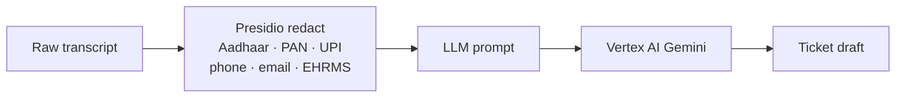

Presidio runs over the conversation transcript **before** the prompt is assembled. The raw transcript is never sent to the LLM. India-specific recognisers: Aadhaar (12-digit), PAN (alphanumeric), India phone (+91), UPI handle, EHRMS ID.

### Guardrails summary

| Concern | Mechanism |
|---|---|
| Cost spike | ₹10k/month budget alarm (70/90/100%); per-user 20 calls/hour; per-session cap of 1 call in Mode A/B |
| LLM unavailable | Template fallback auto-engages — escalation never blocks |
| Kill-switch | `LLM_KILL_SWITCH=true` env var forces template-only without redeploy |
| PII leak to LLM | Presidio mandatory at `transfer_llm` boundary; CI rule |
| Off-topic (Mode D) | Banned topics list in YAML `safety.banned_topics`; topical guardrails |
| Output hallucination (Mode D) | Outlines/Instructor forces structured output |
| Token over-run | `max_tokens_total` per session declared in flow YAML |

### Model

| Property | Value |
|---|---|
| Provider | Vertex AI (direct SDK — no LangChain wrapper) |
| Model | `gemini-2.5-flash` |
| Region | `asia-south1` (Mumbai) — India data residency |
| Auth | Service Account (Vertex AI User role, least privilege) |
| Observability | Every call captured in Langfuse (prompt, completion, latency, tokens, cost estimate) |

---

## 9. Exemplar Use Cases

### Mode A — Certificate Download

```
User opens chat
  → quick_replies: [Certificate not visible | Download fails | Wrong name | Course incomplete]
  → branch on choice
        C1 (not visible) → dynamic_options picker (API: completed courses)
                         → api_call: GET /api/certificate/v1/status
                         → branch on cert_status
                               "generated"   → resolution: cache steps → satisfied / ticket
                               "pending"     → resolution: wait 24h → wait / ticket
                               "not_eligible"→ resolution: complete the course
        C2 (download)    → resolution: browser fix steps → satisfied / ticket
        C3 (wrong name)  → collect: email + correct_name + current_name → ticket
        C4 (incomplete)  → dynamic_options picker → ticket
  → any ticket path → api_call: POST /tickets (Jinja body from collected) → confirmation
```

Every path is scripted. Zero LLM. Full trace in Langfuse as FSM spans.

---

### Mode B — Profile Completion

```
Session starts
  → api_call: GET /api/user/private/v1/read/{user_id}  (fetch profile)
  → branch: if completion_pct == 100 → already_complete (end)
            else → diagnose which field is missing
  → resolution node per field (photo / cover / about_me / EHRMS / designation)
  → follow_up: satisfied?
       yes → self_served end
       no  → increment_and_branch dissatisfaction_count
                 count < 2 → ask_reclassify → deterministic loop
                 count ≥ 2 → transfer_llm
                               Presidio redact transcript
                               Vertex AI: "summarise into ticket description"
                               → show draft → user confirms
                               → api_call: POST /tickets (cf_llm_involved: true)
                               OR (if LLM fails) template fallback → same ticket path
```

The LLM sees: redacted transcript + `collected` dict (completion_pct, field names tried) + `llm_directives.objective`. It cannot change conversation routing.

---

## 10. Security & Data Handling

### Authentication

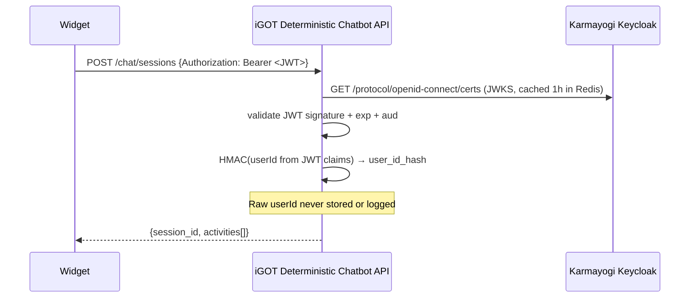

### PII handling

| Data type | Handling |
|---|---|
| `user_id` (Karmayogi) | HMAC'd at API boundary. Hash stored. Raw id discarded. |
| Email, phone, name | Stored in `collected` only during active session. Redacted from LLM prompts via Presidio. PII-redacted transcript attached to Zoho ticket. |
| Aadhaar, PAN, UPI | Regex-detected and masked before any logging or LLM call. |
| Conversation transcript | Persisted to Postgres `messages` table. Retained per DPDP policy. User can request deletion via `DELETE /admin/sessions/{id}`. |
| LLM prompt | Presidio-redacted transcript only. Never raw user data. |

### Audit log

Every profile-read API call and every PII mutation logs an entry to `audit_log` (Postgres):

```
session_id | user_id_hash | action | target_field | timestamp | channel
```

Langfuse captures the full FSM execution trace (node-by-node) + LLM call spans (prompt, completion, latency, cost) for every session.

---

## 11. Tech Stack

| Technology | Role | Rationale |
|---|---|---|
| **Python 3.11+** | Language | Team familiarity; async ecosystem; existing legacy in Python |
| **FastAPI** | API framework | Async-first; auto OpenAPI; same as legacy |
| **LangGraph** | Engine / orchestrator | Production-ready state machine with Redis checkpointer; team-familiar; same framework for all 4 modes |
| **Pydantic v2** | Data validation | `ConversationState`, `Activity`, `TicketDraft` schemas |
| **SQLAlchemy 2.0 + Alembic** | ORM + migrations | Async; pairs with Pydantic; Postgres |
| **PostgreSQL 16 + pgvector** | Persistent store | Karmayogi's existing shared cluster; pgvector for Phase 3 RAG |
| **Redis 7** | Session state + cache | Karmayogi's existing Redis; LangGraph checkpointer; JWKS + master-data cache |
| **ruamel.yaml** | YAML parser | Round-trip preserving (keeps comments) |
| **simpleeval** | Branch expression evaluator | Sandboxed `eval`-free; safe for context-variable access in `branch` rules |
| **Jinja2 (SandboxedEnvironment)** | Template engine | Bot messages + Zoho ticket payloads |
| **httpx** | HTTP client | Async; HTTP/2; used by all adapters |
| **Vertex AI Gemini 2.5 Flash** | LLM (Mode B+) | India residency (Mumbai); direct SDK; cost-efficient; no LangChain dependency |
| **Microsoft Presidio** | PII redaction | Custom India recognisers (Aadhaar, PAN, UPI, EHRMS, India phone) |
| **Vertex AI Gemini** (translation) | Translation — primary | Reuses existing GCP credentials; best quality for code-mixed Indian text |
| **Google Cloud Translation API v3** | Translation — fallback | Same GCP project (ADC); low-latency; no extra key needed |
| **Bhashini ULCA** | Translation — last resort | Free, GoI-run; best for low-resource Indian languages; unreliable uptime |
| **Langfuse (self-hosted)** | Observability | FSM + LLM unified trace; ClickHouse-backed; OSS; self-hosted India |
| **Kibana / Elasticsearch** | App logs | Karmayogi's existing stack |
| **Prometheus** | Metrics | `/metrics` endpoint; standard |
| **Docker + EKS** | Runtime | Karmayogi's existing Kubernetes cluster |
| **GitHub Actions** | CI/CD | YAML validation + tests on every PR |

---

## 12. How to Add a New Flow

### Step 1 — Capture the SOP

Sit with the L1 team. Map the SOP as a decision tree:
- What question does the bot ask first?
- What are the branches? (typically 2–5)
- What API calls does each branch need?
- What does success look like? (user resolves / ticket raised)
- What information goes on the Zoho ticket?

### Step 2 — Choose a mode

All Phase 1 flows are **Mode B** (`deterministic_with_llm_fallback`). Mode A (`deterministic`) is reserved for flows that never need an LLM-written ticket summary — currently none.

| Pattern | Mode |
|---|---|
| SOP is finite and scriptable, always escalate with template ticket | `deterministic` (Mode A) |
| SOP is finite and scriptable, but AI-written ticket summary helps L2 | `deterministic_with_llm_fallback` (Mode B) — **use this** |
| User's opening message is free-text and genuinely ambiguous | Mode C — Phase 3 |
| Truly open-ended (recommendation, KB Q&A) | Mode D — Phase 3 |

### Step 3 — Write the YAML

```bash
cp flows/mode_b_login_issue.yaml flows/mode_b_karma_points.yaml
```

Minimum required structure:

```yaml
flow_id: KARMA_POINTS_NOT_CREDITED    # unique SHOUTY_SNAKE
flow_type: deterministic_with_llm_fallback
version: 1

metadata:
  menu_label:       "⭐ Karma points issue"   # ← appears as a button in the topic picker
  menu_group:       "Learning"               # logical group for future UI grouping
  menu_order:       11                       # position in picker (lower = higher)
  category:         recognition
  classification:   Service Request
  default_priority: P4
  default_severity: Sev 4

enabled_channels: [web]               # web only — do not add whatsapp/voice/mobile yet

entry_node: ask_karma_issue

imports:
  - _terminal
  - fragment: _zoho_ticket
    with:
      cf_category:     recognition
      cf_sub_category: karma_points
      cf_flow_id:      KARMA_POINTS_NOT_CREDITED

nodes:
  - id: ask_karma_issue
    type: message
    prompt:
      text: "What's the karma points issue?"
    quick_replies:
      - { id: A, label: "Not credited after course completion" }
      - { id: B, label: "Wrong amount credited" }
    disable_input: true
    on_reply:
      save_to: collected.sub_scenario
      next: branch_on_issue

  - id: branch_on_issue
    type: branch
    rules:
      - { if: "ctx.collected.sub_scenario == 'A'", then: resolution_not_credited }
      - { if: "ctx.collected.sub_scenario == 'B'", then: resolution_wrong_amount }
    default: resolution_generic

  - id: resolution_not_credited
    type: resolution
    prompt:
      text: "Let's check why your karma points weren't credited:"
    steps:
      - "Wait 24 hours after course completion — points are updated in batches."
      - "Refresh your profile page and check the leaderboard again."
      - "If still missing after 24 hours, we'll raise a support ticket."
    follow_up:
      text: "Did this resolve your issue?"
      quick_replies:
        - { id: YES, label: "✅ Yes, points are now showing" }
        - { id: NO,  label: "❌ No, still missing" }
    on_reply:
      YES: satisfied
      NO:  track_dissatisfaction

  - id: track_dissatisfaction
    type: increment_and_branch
    counter: dissatisfaction_count
    rules:
      - { if: "ctx.counters.dissatisfaction_count < 2", then: resolution_generic }
      - { if: "ctx.counters.dissatisfaction_count >= 2", then: transfer_to_llm }
    default: transfer_to_llm

  - id: transfer_to_llm
    type: transfer_llm
    auto_raise: true
    llm_context:
      include_messages:  true
      include_collected: true
    llm_directives:
      objective: |
        The user's karma points are not credited after course completion.
        Generate a clear Zoho support ticket describing the issue.
      priority_override: P4
    on_complete: confirm_ticket    # → _zoho_ticket fragment

  # satisfied and ticket_raised_end come from _terminal import
  # confirm_ticket, ticket_confirmation, ticket_failed_end come from _zoho_ticket import
```

**Rules for flow authors:**
- Every `next:`, `on_success:`, `then:`, and `on_reply` value must be a node `id` in the same file (or provided by an imported fragment).
- Branch expressions only reference `ctx.collected.*`, `ctx.counters.*`, or literal values.
- Do not add `transfer_llm` / `llm_choose` / `open_llm_subgraph` in a `flow_type: deterministic` flow.
- Do not add `dtmf:` or `spoken_label:` to quick_replies — voice is disabled.
- All Zoho ticket fields come from `ctx.collected` and `ctx.ticket_draft` via Jinja — nothing hardcoded in Python.

---

### When to request a Python change (vs. doing it in YAML)

**You can do in YAML — no Python needed:**
- Add a new flow (new YAML file, any nodes, any API calls to existing integrations)
- Add the flow to the topic picker (set `metadata.menu_label`)
- Hide/show a flow (set `metadata.menu_hidden: true/false`)
- Change the bot's greeting, error messages, or persona (`flows/_shared/system_messages.yaml`)
- Change resolution steps, prompts, or button labels
- Add a new branch path or modify routing logic
- Import a shared fragment (`_zoho_ticket`, `_otp_flow`, `_karmayogi_user`, `_terminal`)
- Change Zoho ticket fields, subject, category, or priority
- Add or remove a Karmayogi API call (using existing `karmayogi` integration)

**Request a Python change for these:**

| Situation | What to ask for | File |
|---|---|---|
| Karmayogi API returns a value in a format no existing transform handles | New `transform:` function | `app/engine/nodes/api_call_node.py` — `_TRANSFORMS` dict |
| Need to call a brand-new external service (not Karmayogi or Zoho) | New service adapter + registry entry | `app/services/<name>.py` + `app/services/registry.py` |
| A new way to render bot output (not text/buttons/picker/input) | New Activity type | `app/engine/activity.py` + relevant node handler |
| New YAML node type that doesn't fit any existing type | New node handler | `app/engine/nodes/<type>_node.py` + `app/engine/nodes/__init__.py` |
| Need a new field validation type (beyond text/email/date) | New `_validate_field_input` branch | `app/api/routes.py` |
| New env variable needed in Jinja templates | Add to `_build_env_vars()` | `app/engine/nodes/api_call_node.py` |

**Rule of thumb:** if you find yourself copy-pasting the same long YAML block across multiple flows, it probably belongs in a new `_shared/` fragment. If the YAML itself can't express what you need, file a Python request.

---

### Step 4 — Validate

```bash
python -m app.engine.compiler --validate flows/
```

CI runs this on every PR. Errors that block merge:
- `next:` or `on_success:` targeting a non-existent node id
- Unknown node `type:`
- LLM node type in a `deterministic` flow
- Missing `flow_id`, `flow_type`, or `entry_node`
- `api_call` with `integration:` not registered
- `api_call` missing `request.method` or `request.url`

### Step 5 — LLM judge evaluation

```bash
python scripts/llm_judge_runner.py --flow KARMA_POINTS_NOT_CREDITED
open test_reports/KARMA_POINTS_NOT_CREDITED_*.html
```

The runner walks every user-choice path, simulates conversations, and asks Claude to judge correctness against the SOP. Review all `FAIL` and `WARN` verdicts before submitting a PR. Reports are saved to `test_reports/` (gitignored).

### Step 6 — Unit tests

Add `tests/flows/test_<flow_name>.py`:

```python
@pytest.mark.asyncio
async def test_karma_points_happy_path(mocked_services):
    compiler = FlowCompiler(services=mocked_services)
    flow = compiler.load_flow(Path("flows/mode_b_karma_points.yaml"))
    graph = compiler.compile_flow(flow)
    state = initial_state(session_id=uuid4(), user_id_hash="hash_x")
    state_dict = state.model_dump(mode="json")
    state_dict["collected"]["sub_scenario"] = "A"
    result = await graph.ainvoke(state_dict, {"configurable": {"thread_id": "test"}})
    assert result["current_node"] == "resolution_not_credited"
```

Cover: happy path, each branch, ticket fallback, any `api_call` error path.

### Step 7 — PR checklist

- [ ] SOP source linked in PR description
- [ ] `metadata.menu_label`, `menu_group`, `menu_order` set
- [ ] `metadata.enabled: true` (default — set `false` only for WIP not yet ready for users)
- [ ] `enabled_channels: [web]` (not multi-channel)
- [ ] All branches tested (happy path + at least one error path)
- [ ] `_zoho_ticket` fragment imported with `cf_category` + `cf_sub_category` + `cf_flow_id`
- [ ] `python -m app.engine.compiler --validate flows/` passes
- [ ] LLM judge run; no unreviewed `FAIL` verdicts
- [ ] `pytest tests/flows/test_<name>.py` passes

---

## 13. Key Design Decisions

| Decision | Choice | Why not the alternative |
|---|---|---|
| **Engine framework** | LangGraph | Custom YAML interpreter: more code to maintain, no built-in checkpointer or Redis support. Rasa/Botpress: vendor lock-in, not India-residency, expensive. |
| **Flow definition format** | YAML | JSON: no comments, verbose. Python DSL: non-developer-hostile. DSL + GUI editor: over-engineering for Phase 1. |
| **LLM as orchestrator** | Rejected | Unpredictable routing, hallucinated steps, no audit trail, expensive at scale — validated by prior project failure. |
| **LLM role** | Ticket summariser only (Mode B) | Single, narrow, auditable task. Every call has a template fallback. |
| **API details location** | YAML `request:` block | Method + URL in Python adapter → flow logic split across two files, non-developer-hostile, impossible to audit without reading Python. |
| **PII handling** | HMAC at boundary + Presidio at LLM boundary | Tokenisation / encryption: complex key management. Presidio: industry standard, India recognisers available. |
| **LLM provider** | Vertex AI Gemini, Mumbai | Anthropic / OpenAI: no India data residency. Azure OpenAI: complex procurement. Vertex AI: GoI-approved cloud, existing GCP account. |
| **Session persistence** | LangGraph Redis checkpointer | Stateless (JWT-only): users lose context on tab refresh. Postgres-only: no native LangGraph integration. Redis: already in Karmayogi infra. |
| **Observability** | Langfuse self-hosted | LangSmith: US-hosted, SaaS. Helicone: US-hosted. Langfuse OSS: self-hosted, ClickHouse-backed, FSM + LLM unified. |
| **Channel abstraction** | Activity envelope + BaseChannelAdapter | Channel-specific templates: duplicated flow logic per channel. Activity envelope: write flow once, render anywhere. |
| **Translation architecture** | Language-at-boundary (runner layer only) | Translate inside flow YAML: logic spread across files, untestable, non-English YAML. Translate in adapter: adapter becomes stateful. Runner layer: single boundary, testable, engine stays English. |
| **Translation provider** | Gemini primary → Google Translate → Bhashini | Gemini: reuses existing credentials. Google Translate: same GCP project, no key. Bhashini: free, India-optimised but unreliable. Composite chain: always one working provider. Fail-open policy: never crash over a translation failure. |
| **Session expiry** | Sliding TTL + graceful restart | Hard TTL: poor UX (times out active conversations). Mid-flow resume: complex (stale data, expired tokens). Sliding TTL + restart message: simple, correct, industry standard. |
| **Engine output interface** | `AsyncIterator[Activity]` (not `list`) | List return: REST works but WebSocket requires engine rewrite. Generator: REST collects, WebSocket streams. Zero engine changes to add a new transport. |
| **Topic menu generation** | YAML metadata (`menu_label`, `menu_group`, `menu_order`) → auto-generated by engine at startup | Hardcoded mapping table in `routes.py`: every new flow requires a Python edit. YAML metadata: adding a flow to the menu requires zero Python changes. |
| **Bot persona / system messages** | `flows/_shared/system_messages.yaml` | Hardcoded strings in `routes.py`: requires a Python PR to change a greeting. YAML file: ops/content team can change any user-facing string without touching Python. |
| **Centralized logging** | `app/logging_setup.py` — colour console + rotating NDJSON file | `logging.basicConfig()`: no colour, no file rotation, all third-party libraries log at same level. Centralized setup: suppresses noisy third-party loggers, ships JSON to log aggregators, provides `SessionLogger` for per-session context. |
| **Zoho ticket identity tag** | Subject prefix `[ITSM Support v2]` + custom field `cf_source = "ITSM Support v2"` | No tagging: tickets from the bot look identical to manual tickets; impossible to query by source. Tagged: ops can filter Zoho by `cf_source` to see all bot-raised tickets and measure deflection. |
| **Conversation transcript for LLM** | `state.messages` (LangGraph `add_messages` reducer) populated on every turn | Not populated (Phase 1 scaffold): LLM only sees `collected` dict, not actual conversation. Message log: LLM reads the full human↔bot exchange; ticket descriptions are coherent and complete. |
